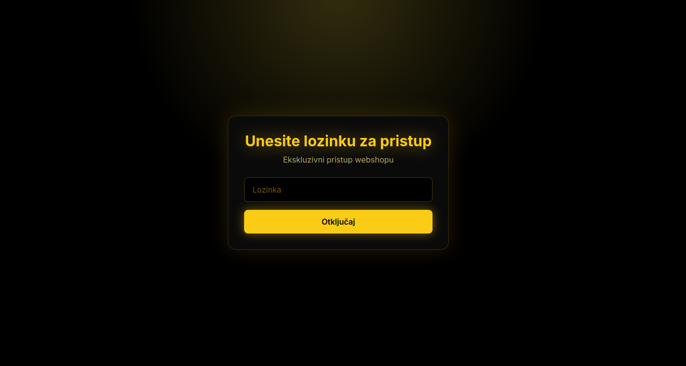
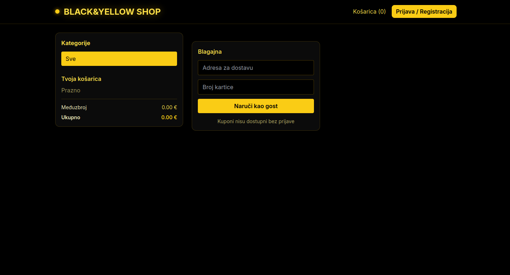

# webshop
Moj zadatak - izrada webshop stranice

Aplikacija predstavlja moderan, vizualno upečatljiv i funkcionalan webshop dizajniran u prepoznatljivoj kombinaciji crne i žute boje. Crna boja dominira pozadinom, stvarajući elegantan, minimalistički i pomalo misteriozan vizualni okvir, dok je tekst istaknut svijetlećim žutim highlight efektom koji daje snažan kontrast i futuristički identitet. Ova kombinacija boja nije odabrana slučajno — psihološki gledano, crna simbolizira luksuz, moć i profesionalnost, dok žuta privlači pažnju, potiče energiju i stvara osjećaj dinamike. Zajedno, one čine vizualni stil koji se izdvaja od klasičnih bijelih i minimalističkih e‑commerce rješenja te webshopu daju prepoznatljiv i moderan karakter.

Jedna od ključnih posebnosti aplikacije je ulazna lozinka. Prije nego što korisnik uopće vidi webshop, mora unijeti lozinku koju vlasnik određuje. Ova funkcionalnost služi kao dodatna razina privatnosti i ekskluzivnosti — webshop može biti namijenjen zatvorenoj grupi kupaca, testnoj fazi, VIP korisnicima ili ograničenoj distribuciji proizvoda. Time se stvara osjećaj posebnosti i kontroliranog pristupa, što može biti iznimno korisno za brendove koji žele zadržati određenu dozu tajnovitosti ili ograničiti pristup samo odabranim korisnicima. Osim toga, ova opcija omogućuje vlasniku da webshop koristi i kao internu platformu, primjerice za zaposlenike, distributere ili poslovne partnere koji trebaju pristup specifičnim proizvodima ili informacijama.

Nakon ulaska, korisnik dolazi na glavno sučelje webshopa koje sadrži kategorije proizvoda, pregled artikala, košaricu i mogućnost naručivanja. Sučelje je intuitivno, pregledno i optimizirano za jednostavno korištenje, bez obzira na to koristi li se aplikacija na računalu, tabletu ili mobilnom uređaju. Posebna pažnja posvećena je responzivnosti i brzini učitavanja, kako bi korisničko iskustvo bilo fluidno i ugodno. Aplikacija je dizajnirana tako da se može koristiti bez prijave i s prijavom, pri čemu obje opcije imaju svoje prednosti i ciljaju različite tipove korisnika.

Korisnici bez prijave mogu slobodno pregledavati sve proizvode, dodavati ih u košaricu i izvršiti narudžbu. Međutim, oni nemaju mogućnost korištenja kupona za popust. Također, svaki put kada naručuju, moraju ponovno unositi adresu i podatke o plaćanju. Ovaj način korištenja idealan je za brze kupnje, jednokratne posjete ili korisnike koji ne žele stvarati račun. Takvi korisnici često cijene jednostavnost i brzinu, pa je važno da proces kupovine bude što manje opterećen dodatnim koracima. Webshop je optimiziran tako da i bez registracije kupovina ostaje jednostavna, jasna i brza.

S druge strane, prijavljeni korisnici dobivaju niz pogodnosti koje im olakšavaju i ubrzavaju kupovinu. Nakon registracije, korisnik može spremiti svoju adresu i podatke o kartici, što znači da ih ne mora unositi pri svakoj narudžbi. Osim toga, samo prijavljeni korisnici imaju mogućnost unosa kupona za popust, što ih motivira da kreiraju račun i ostanu lojalni webshopu. Ovaj sustav nagrađivanja povećava angažman, potiče ponovne kupnje i omogućuje vlasniku webshopa da gradi dugoročan odnos s kupcima. Registrirani korisnici također mogu dobivati personalizirane ponude, obavijesti o akcijama, preporuke temeljene na njihovoj povijesti kupovine ili pristup ekskluzivnim proizvodima.

Tematika webshopa odabrana je zato što online kupovina postaje dominantan oblik trgovine. Sve više korisnika preferira jednostavnost, brzinu i dostupnost kupovine putem interneta. Webshopovi su danas ključni dio poslovanja, a personalizirani dizajn i dodatne funkcionalnosti mogu značajno povećati prodaju i korisničko zadovoljstvo. Crno‑žuta estetika daje aplikaciji snažan vizualni identitet, dok funkcionalnosti poput lozinke na ulazu i razlike između prijavljenih i neprijavljenih korisnika stvaraju jedinstveno korisničko iskustvo. Kombinacija modernog dizajna, sigurnosnih elemenata i praktičnih opcija čini ovaj webshop atraktivnim, profesionalnim i prilagođenim potrebama suvremenih kupaca. Upravo ta kombinacija estetike i funkcionalnosti čini aplikaciju konkurentnom i spremnom za stvarno tržište.

## Ova aplikacija rješava nekoliko problema:

 - **Omogućuje siguran i kontroliran pristup webshopu** 
- **Nudi jednostavnu kupovinu bez registracije** 
 - **Nagrađuje prijavljene korisnike dodatnim pogodnostima** 
- **Omogućuje brzu ponovnu kupovinu zahvaljujući spremanju podataka** 
- **Pruža moderan i atraktivan dizajn koji se ističe na tržištu**

## Ciljni korisnici su:

- **kupci koji žele brzu kupovinu bez registracije**

- **korisnici koji žele pogodnosti i popuste kroz prijavu**

- **VIP kupci ili zatvorene grupe kojima je pristup webshopu ograničen lozinkom**

- **mlađa publika koja preferira tamne, modernije i gaming‑inspirirane dizajne**

Aplikacija je fleksibilna, vizualno upečatljiva i funkcionalno bogata, što je čini idealnim rješenjem za suvremeni e‑commerce.

## Osnovne funkcionalnosti

| Funkcionalnost | Opis |
|----------------|------|
| **Ulazna lozinka** | Prije ulaska u webshop korisnik mora unijeti lozinku. |
| **Pregled proizvoda** | Prikaz svih dostupnih proizvoda s detaljima. |
| **Kategorije proizvoda** | Grupiranje proizvoda prema kategorijama radi lakše navigacije. |
| **Košarica** | Dodavanje, uklanjanje i pregled proizvoda u košarici. |
| **Kupovina bez prijave** | Korisnik može naručiti bez kreiranja računa. |
| **Ručni unos adrese i plaćanja** | Neprijavljeni korisnici moraju svaki put unijeti adresu i podatke o plaćanju. |

## Napredne funkcionalnosti

| Funkcionalnost | Opis |
|----------------|------|
| **Registracija i prijava** | Kreiranje korisničkog računa i prijava u sustav. |
| **Spremanje adrese** | Prijavljeni korisnici unose adresu samo jednom. |
| **Spremanje kartice** | Brže plaćanje jer se podaci o kartici pamte. |
| **Kuponi za popust** | Dostupni samo prijavljenim korisnicima. |
| **Korisnički profil** | Pregled spremljenih podataka i povijesti narudžbi. |
| **Administratorski panel** | Upravljanje proizvodima, kuponima i korisnicima (opcionalno). |

## Scenarij korištenja (korisnički tijek)
1. **Ulazak u webshop**

    Korisnik otvara webshop.
    Prikazuje se crni ekran s žutim svijetlećim tekstom: "Unesite lozinku za pristup".
    Nakon unosa ispravne lozinke, korisnik ulazi u webshop.

2. **Početna stranica** 

    Prikazuje se pregled kategorija i istaknutih proizvoda.
    Navigacija je jednostavna, s crnom pozadinom i žutim hover efektima.

3. **Pregled proizvoda** 

    Korisnik odabire kategoriju.
    Otvara stranicu proizvoda i dodaje artikle u košaricu.

4. **Odabir načina kupovine**

    Opcija A — Bez prijave:

    Korisnik ide na blagajnu.
    Unosi adresu i podatke o plaćanju.
    Ne može unijeti kupon.
    Završava narudžbu.

    Opcija B — S prijavom:

    Korisnik se prijavljuje ili registrira.
    Adresa i kartica su već spremljeni.
    Ima polje za unos kupona.
    Završava narudžbu brže i uz popust (ako postoji).

5. **Potvrda narudžbe**

    Korisnik dobiva potvrdu i može vidjeti detalje narudžbe.

    
    
    
    